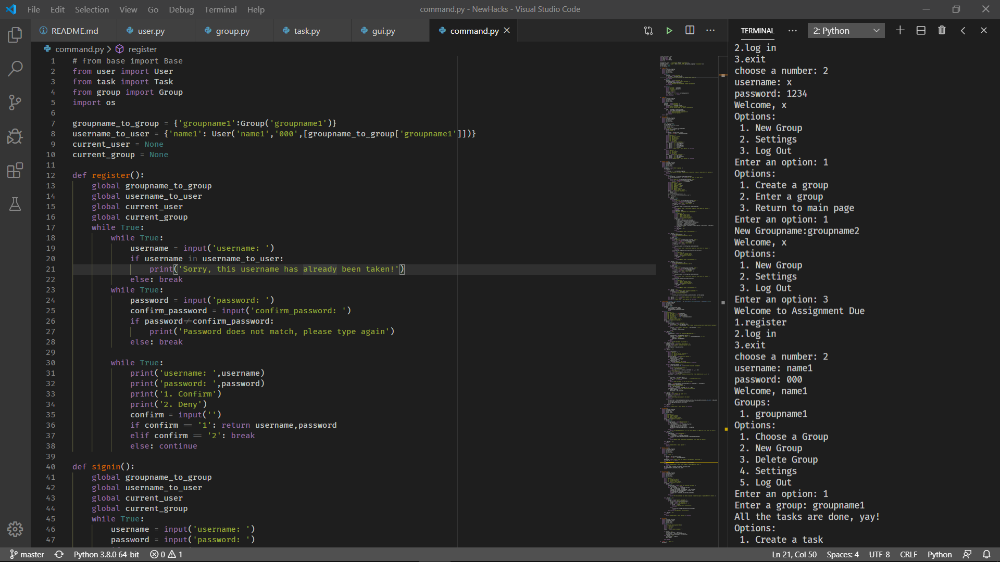

# Assignment Due
## About
This is a project for NewHacks2020 at the University of Toronto. This project aims to create a a TODO like software named Assignment Due that can assign and delete group tasks.
## Contributors
Chunsheng Zuo, Yunhao Qian, Guanghan Wang, Xuanze Li

Our team's main objective is to create a software named Assignment Due that can assign and delete group tasks supporting multi-users. The software is pretty similar to the To-Do list apps that can be download from the App Store some other online app stores, with additional multiuser features and task attributes.

To run the program, you must have Python 3 installed on your computer, and run either command.py or gui.py to enter the user interface. The command.py is a command line version interface and the gui.py is graphic user interface.

### Screenshot of the command line version
